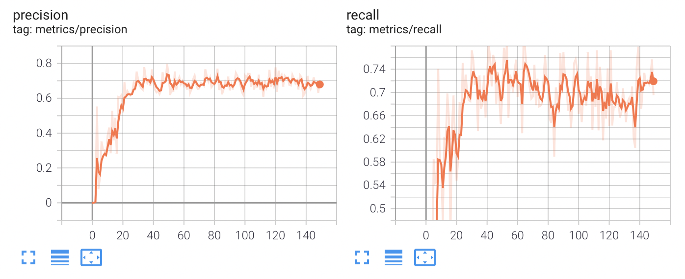
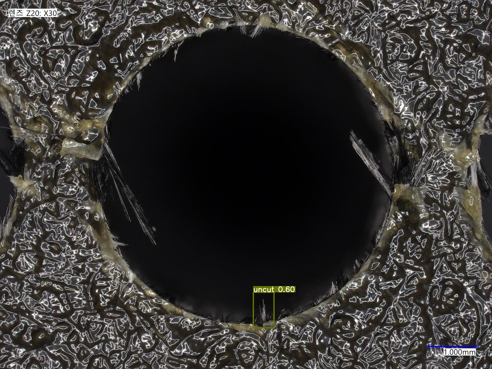
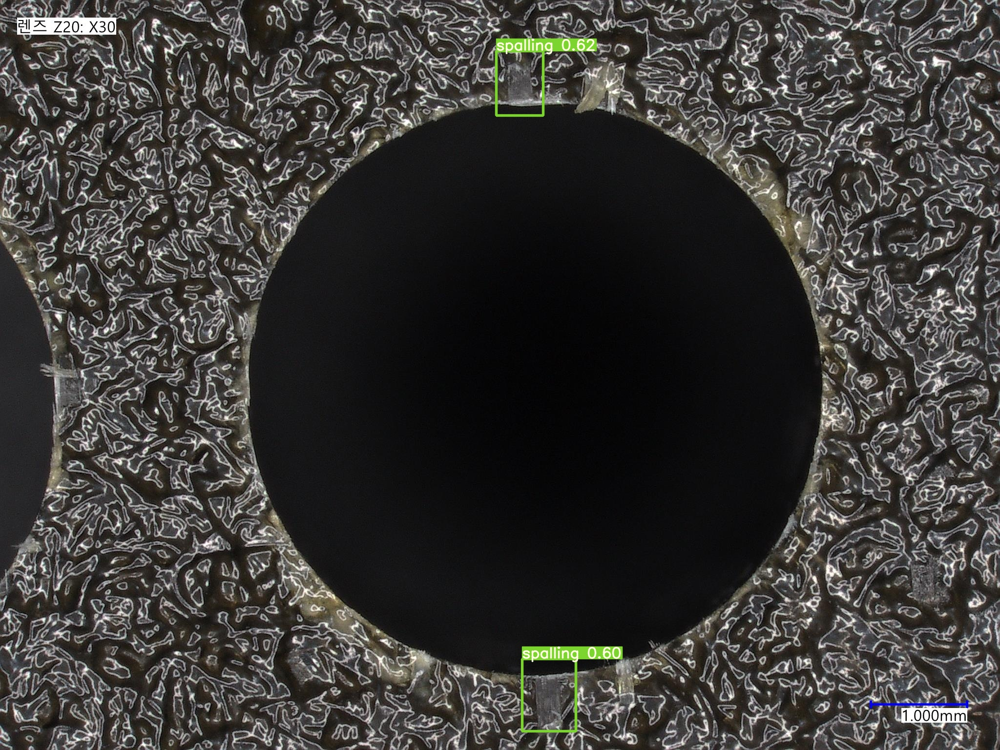
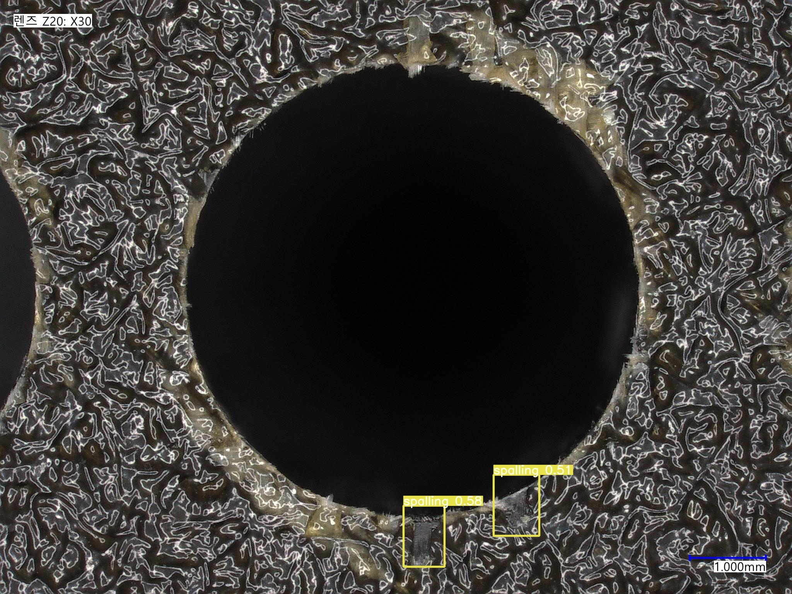

## **이미지 448장 epoch 150 학습 결과**

epoch을 늘려도 검출률이 20 ~ 30%에 머물러있어 라벨링을 재시도함.

448장의 이미지, epoch 150의 학습 결과 약 정밀도와 재현율 모두 70%정도로 측정됨.

몇몇 검출이 되긴하지만 검출되지 않는 결함부분이 더 많다.

### 정밀도와 재현율

### 검출 테스트 이미지

